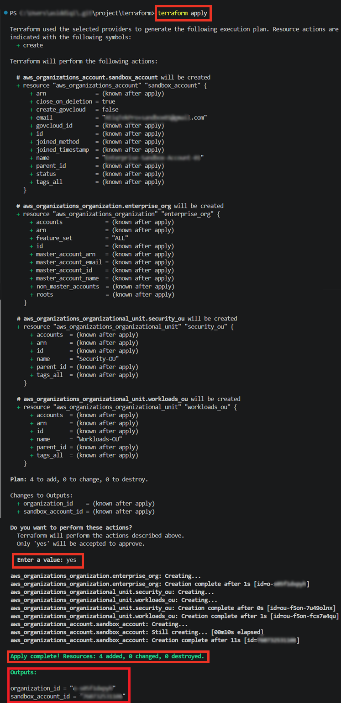
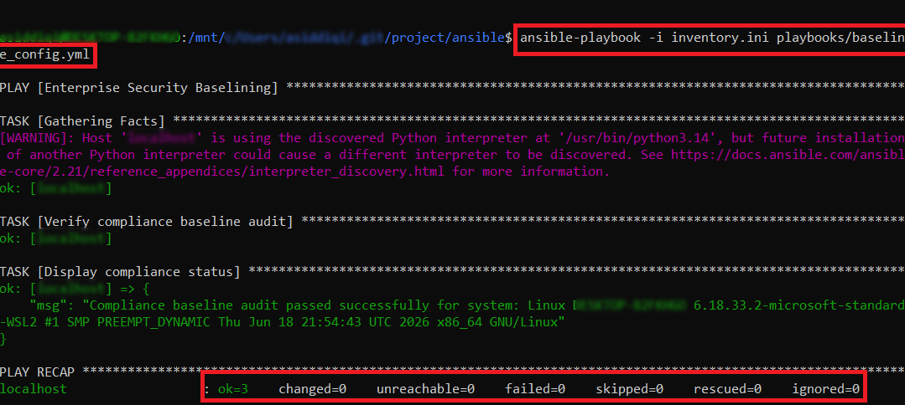

# Enterprise AWS Landing Zone & Multi-Account Governance

A production-ready reference architecture and automation framework for deploying, securing, and governing multi-account enterprise cloud environments on AWS. This project establishes core organizational guardrails, automates isolated account provisioning via **Terraform**, and enforces continuous compliance baselines using **Ansible**.

---

## 🚀 Project Overview
Architected and deployed a secure, multi-account AWS environment utilizing AWS Control Tower, Terraform, and Ansible to automate baseline configuration and IAM guardrails. This project simulates an enterprise-grade landing zone designed to eliminate manual provisioning delays and ensure strict multi-account security compliance during large-scale corporate migrations.

---

## 🛠️ Tech Stack
* **Cloud Platform:** AWS (Control Tower, AWS Organizations, IAM, Systems Manager, S3)
* **Infrastructure as Code (IaC):** Terraform (modular structure supporting multi-account environments)
* **Configuration Management & Automation:** Ansible (automated server baselining and patch management)
* **Governance & Security:** Service Control Policies (SCPs), regional restrictions, and encryption enforcement

---

## 📐 Repository Architecture & Structure

```text
enterprise-aws-landing-zone-terraform/
├── ansible/
│   ├── inventories/
│   │   └── inventory.ini
│   └── playbooks/
│       └── baseline_config.yml
├── terraform/
│   ├── environments/
│   │   └── prod/
│   │       ├── iam_guardrails.tf
│   │       ├── main.tf
│   │       ├── outputs.tf
│   │       └── variables.tf
│   └── modules/
│       ├── control_tower_ous/
│       │   ├── main.tf
│       │   └── outputs.tf
│       └── sandbox_account/
│           ├── main.tf
│           └── outputs.tf
└── README.md
```

## 🚀 Step-by-Step Deployment Guide
**Step 1: Initialize Terraform Foundation**
* Navigate to the production environment directory:
```text
Bash
cd terraform/environments/prod
```
* Run _terraform init_ to download required AWS provider dependencies.

* Review the execution plan via _terraform plan_ to confirm structural resource creation for core OUs and sandbox accounts.

**Step 2: Apply Infrastructure Provisioning**
* Execute _terraform apply_ to provision the AWS Organization structure, IAM security boundaries, and sandbox account baseline.

* Capture output reference identifiers including organizational unit IDs and provisioned account parameters.

**Step 3: Configure Ansible Inventory**
* Update the inventory mapping file (_ansible/inventories/inventory.ini_) to target your newly provisioned node endpoints or security groups.

* Ensure SSH key paths and access permissions match your target instance configurations.

**Step 4: Execute Security Baseline Playbook**
* Run the configuration compliance playbook to lock down system baselines and install required security agents:
```text
Bash
ansible-playbook -i inventories/inventory.ini playbooks/baseline_config.yml
```
* Verify clean execution summaries ensuring zero configuration drift and successful audit verification.

## 📊 Result Output & Execution Evidence

### Terraform Infrastructure Provisioning Output
Successfully provisioned the core AWS Organization structure, Security/Workloads OUs, sandbox account, and IAM SCP bindings:


### Ansible Configuration Compliance Output
Successfully verified compliance baselines and configuration management execution across nodes:


## 📈 Key Performance & Governance Metrics
* **Provisioning Speed:** Automated baseline configurations to reduce environment setup time from days to under 30 minutes.

* **Scale & Governance:** Successfully enforced standardized IAM guardrails and compliance policies across simulated enterprise AWS accounts.

* **Operational Efficiency:** Achieved zero-drift compliance enforcement using automated Ansible playbooks.

