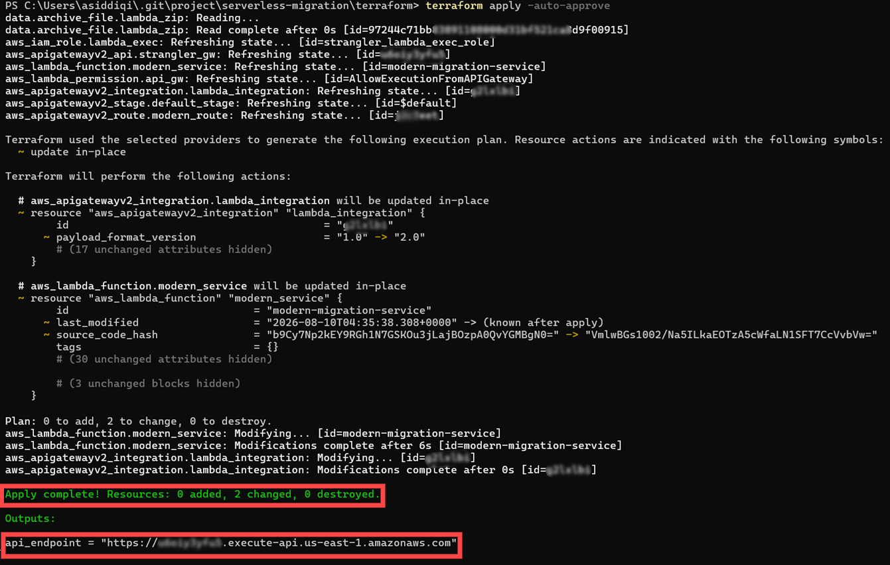
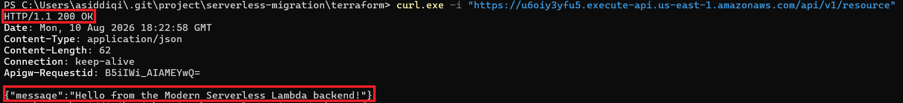
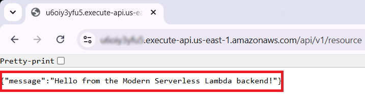

# Serverless Migration & Modernization Prototype: Strangler Fig Pattern on AWS
Modernizing legacy enterprise systems without causing downtime or disrupting business operations is one of the most critical challenges in cloud architecture. To explore this, I designed and built an event-driven microservice prototype leveraging **AWS Lambda, API Gateway,** and **Amazon ECS** to benchmark zero-downtime cutovers using the **Strangler Fig Pattern.**

## 🏗️ Architecture & Modernization Strategy
The core objective of the **Strangler Fig Pattern** is to incrementally replace legacy components by routing specific traffic domains to modern cloud-native microservices while leaving legacy endpoints untouched until full deprecation.
```text
[ Client / Consumer ]
          │
          ▼
  [ AWS API Gateway (HTTP API) ]
          │
          ├──► GET /api/v1/resource ──► [ AWS Lambda (Modern Backend) ]
          │
          └──► (Legacy Routes)      ──► [ Legacy Backend (Simulated ECS/EC2) ]
```
* **Ingress Routing Layer: AWS API Gateway (HTTP API v2)** acts as the single entry point, intercepting requests and intelligently routing paths.

* **Modernized Microservice:** Migrated business logic executing on **AWS Lambda** (Node.js runtime), built for ephemeral, scalable execution.

* **Legacy Decoupling:** Legacy endpoints remain isolated behind alternative routes (simulated via ECS/EC2 targets) to maintain backward compatibility during incremental migration.

## 🛠️ Tech Stack & Implementation Details

* **Infrastructure as Code (IaC):** Fully provisioned and managed via **Terraform**, ensuring declarative, reproducible infrastructure states.

* **API Routing & Integration:** AWS API Gateway HTTP API integrating directly with Lambda via _AWS_PROXY_ payload format v2.

* **Compute:** AWS Lambda configured with dedicated IAM execution roles (_strangler_lambda_exec_role_) and automated code packaging.

---

## 🚀 Quick Start Deployment

### Prerequisites
* [AWS CLI](https://aws.amazon.com/cli/) configured with appropriate permissions.
* [Terraform](https://www.terraform.io/) installed (v1.0+).

### 1. Initialize Infrastructure
Navigate to the terraform directory and initialize providers:

```bash
cd terraform
terraform init
```

### 2. Deploy the Prototype
Run the automated deployment plan to provision the API Gateway and Lambda backend:

```bash
terraform apply -auto-approve
```
### 3. Test the Endpoint
Test the modernized route using the output API endpoint from Terraform:

```bash
curl -X GET "<your-api-gateway-endpoint>/api/v1/resource"
```

## 📊 Result Output & Execution Evidence
**1. Successful Terraform Deployment & Output**



**2. Terminal API Routing & Response Test (**_curl_**)**



**3. Browser-Based Endpoint Verification**



## 🧹 Cleanup & Cost Management
To tear down all provisioned AWS resources and avoid lingering cloud costs, run:

```bash
cd terraform
terraform destroy -auto-approve
```
